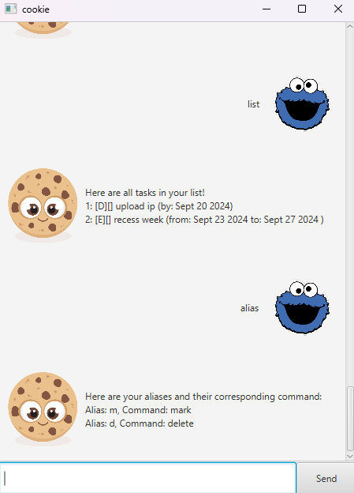

# Cookie User Guide


This is Cookie! Your personal chat bot for managing your tasks!

## Listing tasks

Lists all the task in the task list.

Format: `list`

## Adding todo tasks

Adds a task of type todo into the task list.

Format: `todo [description]`

Example: `todo CS2103T iP`

```
Got it. Cookie has added this task:
[T][] CS2103T iP
Now you have X tasks in the list.
```

## Adding deadline tasks

Adds a task of type deadline into the task list.

Format: `deadline [description] by [time]`

Example: `deadline submit homework /by 2024-09-20`

```
Got it. Cookie has added this task:
[D][] submit homework (by: Sept 20 2024)
Now you have X tasks in the list.
```

## Adding event tasks

Adds a task of type event into the task list.

Format: `event [descruption] /from [time] /to [time]`

Example: `event recess week /from 2024-09-24 /to 2024-09-28`

```
Got it. Cookie has added this task:
[E][] recess week (by: Sept 24 2024 to: Sept 28 2024)
Now you have X tasks in the list.
```
If the time is not in the format `[yyyy-mm-dd]` it will be treated as a `String`

## Marking tasks as done

Marks a task as done.

Format: `mark [task number]`

Example: `mark 1`

```
Cookie has marked this as done! Good job!
[D][X] submit homework (by: Sept 20 2024)
```

## Marking tasks as not done

Marks a task as not done.

Format: `unmark [task number]`

Example: `unmark 1`

```
Cookie has unmarked this task!
[D][] submit homework (by: Sept 20 2024)
```

## Deleting tasks

Deletes a task from the task list.

Format: `delete [task number]`

Example: `delete 1`

```
Cookie has removed the following task from your list:
1: [D][] submit homework (by: Sept 20 2024)
Now you have X tasks in the list.
```

## Finding tasks by keyword

Finds all the task that contains the `keyword` from the task list.

Format: `find [word]`

Example: `find homework`

```
Here are matching tasks in your list!
1: [D][] submit homework (by: Sept 20 2024)
```

## Setting command aliases

Sets an alias for a command. Now you can use the alias as a shortcut for the command.

Format: `set [command] [alias]`

Example: `set delete d`

```
You have successfully set d as delete
```

## Viewing command aliases

Views all the aliases and their corresponding command.

Format: `alias`

Example: `alias`

```
Here are your aliases and their corresponding command:
Alias: d, Command: delete
```

## Exiting

Closes the GUI and saves all the task in the task list.

Format: `bye`